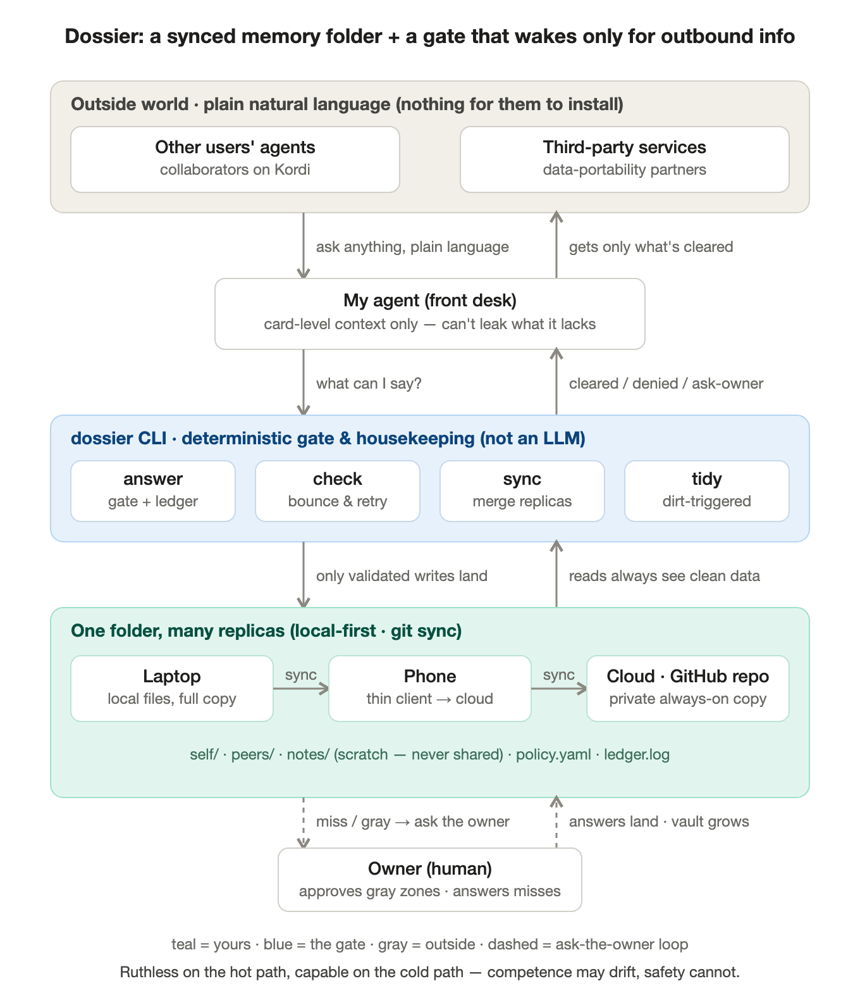

# doss

[](https://doss-docs-shenzhe-zhus-projects.vercel.app)

> A synced memory folder your agents read and write as plain files — with rules, in a file, for what may leave.
> Your agent's memory, your rules.

*Doss* is short for *dossier* — the file you keep on someone. Here it's the file **you** keep on **yourself**: one place that holds who you are, that you own, and that decides for itself how much of you the outside world gets to see.

For your agent: long-term memory as plain md/yaml files — remember = write a file, recall = read a file. Zero ceremony.
For everyone else: `policy.yaml` says which groups of people may see which folders of your info (default: nothing). Your agent reads it, shares only what's granted, and logs each disclosure.
The other side installs nothing. Useful at n=1 (multi-device memory + disclosure discipline); upgrades automatically when both sides run it.

Status: v0 in development · [Design](docs/design/plan-v0.1.md) · [Roadmap issues](https://github.com/Kordi-AI/doss/issues)

## Install

**Option 1 — do it yourself**

```sh
curl -fsSL https://raw.githubusercontent.com/Kordi-AI/doss/main/install.sh | sh
doss init            # guided setup — just answer the questions
```

The installer grabs a prebuilt binary for your OS/arch (macOS/Linux, amd64/arm64), falling back to a source build if you have Go. No prebuilt for your platform? `git clone https://github.com/Kordi-AI/doss && cd doss && ./install.sh`.

Run in a terminal, `doss init` walks you through it: new vault or connect to an existing cloud one · the name/email your vault commits as · whether to back it up to a private GitHub repo (it takes a token if `gh` isn't logged in).

**Option 2 — paste this to your agent**

> Please install Doss and set up my memory vault:
> 1. `git clone https://github.com/Kordi-AI/doss && cd doss && ./install.sh`
> 2. **Ask me** which name and email my vault's git commits should use, then run `doss init --github --git-name "…" --git-email "…"` (drop `--github` if I don't have gh or don't want a cloud copy; use `--from owner/repo` if I already have a cloud vault)
> 3. Check the `connect` output it prints: if your own tool is NOT listed there, wire yourself with `doss connect --file <the instruction file you load every session>`.
> 4. Read `~/.doss/SKILL.md` and manage my memory by its rules from now on.

**Second device?** Run `doss init` and pick *"connect to my existing cloud vault"* — give it your repo (e.g. `ShenzheZhu/my-doss`) and every device shares one memory, kept aligned by `doss sync`. Agents can skip the questions with `doss init --from owner/repo`.

`init` automatically runs `doss connect`, which drops a small managed section into each installed agent's **always-loaded global instruction file** — `~/.claude/CLAUDE.md` (Claude Code), `~/.codex/AGENTS.md` (Codex), `~/.gemini/GEMINI.md` (Gemini CLI), OpenClaw's workspace `AGENTS.md`, Windsurf's global rules. Agents we've never heard of work too: `doss connect --file <the instruction file it always loads>`. The section carries the vault path and the non-negotiables and is injected deterministically into every session of every project. Whichever agent sets Doss up, every other agent on the machine discovers it in its next session.

Installed a new agent tool later? Rerun `doss connect`. Verify anytime with `doss doctor` (`--fix` repairs). Undo with `doss connect --remove`.

## Usage

After setup, an agent only needs four habits (details in the generated `~/.doss/SKILL.md`):

| When | Do |
| --- | --- |
| Learned something durable | Write a small file under `self/` — the path is the topic |
| Need to recall | Just `ls` / `grep` / read files |
| Finished editing | `doss check --changed` (errors are precise; fix and rerun) |
| Wrapping up | `doss sync` (unvalidated content never syncs) |

## Commands

| Command | What it does |
| --- | --- |
| `doss init` | Create a vault, or `--from owner/repo` to attach another device |
| `doss connect` | Wire the vault into every installed agent (auto-run by init) |
| `doss check` | Validate memory files; bad writes bounce with precise errors |
| `doss sync` | Commit + pull + push; only validated state ever leaves |
| `doss log` | `--record` a disclosure; plain `doss log` reads "who knows what about me" |
| `doss doctor` | Full health: vault, sync, wiring, hooks; `--fix` repairs (alias: `status`) |
| `doss tidy` | What needs your judgment: stale facts, unconfirmed guesses, notes backlog |
| `doss uninstall` | Delete the local vault and unwire agents (safe when a cloud copy exists) |

## Architecture



## Docs

- [Documentation site](https://doss-docs-shenzhe-zhus-projects.vercel.app) — Overview, Getting started, Concepts, Commands, How it works
